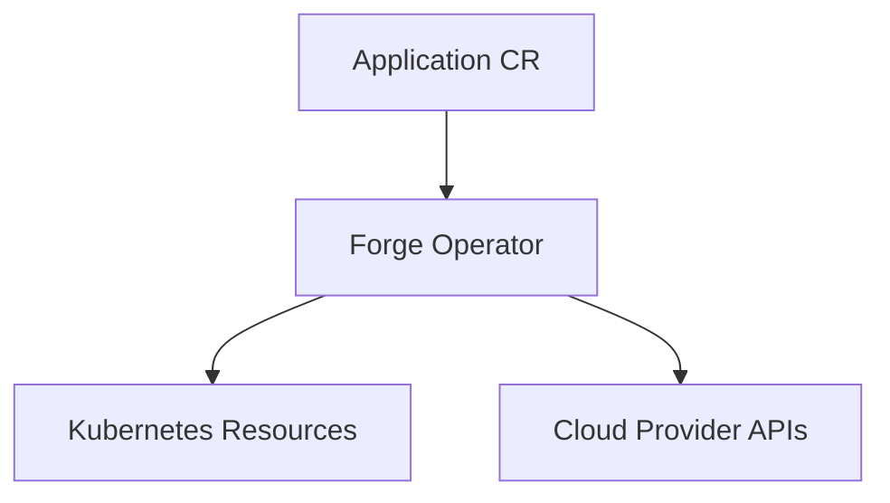
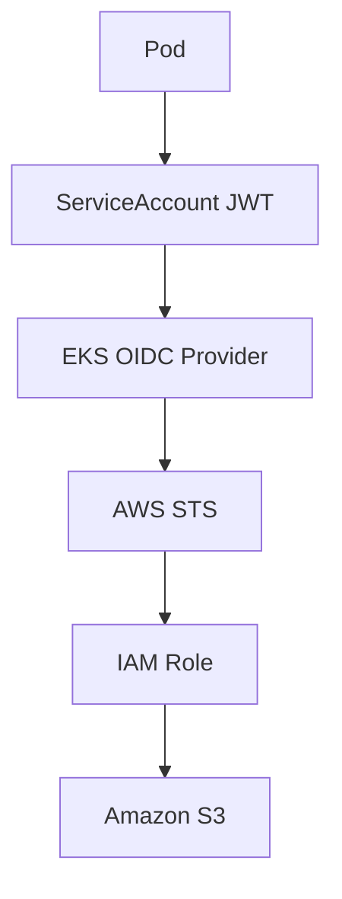
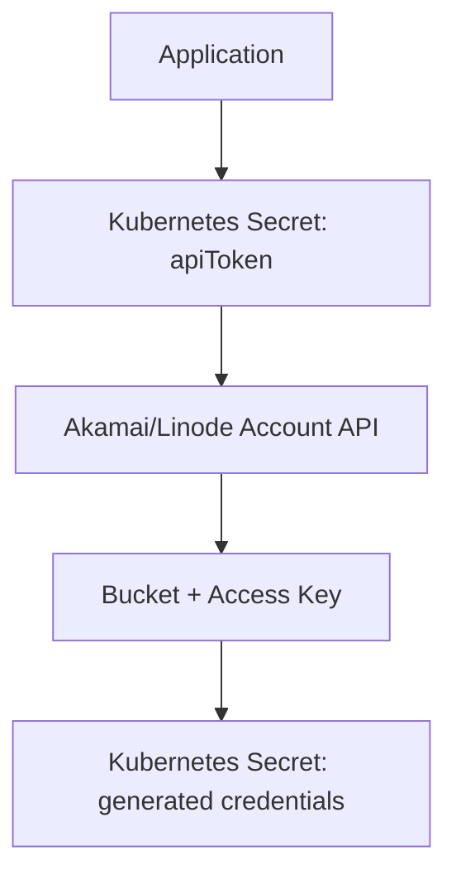
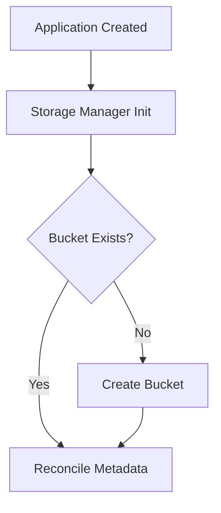

# Forge Operator

[](https://github.com/Ningendo7/forge-operator/actions/workflows/test.yml)
[](https://github.com/Ningendo7/forge-operator/actions/workflows/test-e2e.yml)
[](https://github.com/Ningendo7/forge-operator/actions/workflows/lint.yml)
[](LICENSE)

Forge Operator is a Kubernetes operator for managing application infrastructure declaratively across cloud providers.

It manages the lifecycle of application workloads, core Kubernetes resources, and cloud-backed object storage through a single `Application` custom resource.

## Supported Providers

| Provider | Compute Target | Object Storage | Authentication Model |
| --- | --- | --- | --- |
| AWS | EKS | Amazon S3 | IAM Roles for Service Accounts (IRSA) |
| Akamai/Linode | LKE (Terraform modules) | Akamai Object Storage | S3-compatible access credentials |
| — | — | None (`Static`/`MinIO`) | No-op — bring your own credentials/Secret |

## Quickstart

The chart enables the Application admission webhooks and cert-manager-issued TLS by default, so **[cert-manager](https://cert-manager.io/docs/installation/) must already be installed in the cluster** before you install this chart — otherwise the install will fail (it creates `Certificate`/`Issuer` custom resources that don't exist without cert-manager's CRDs). If you don't want that, pass `--set certManager.enabled=false --set webhook.enabled=false`; see [Webhooks](#webhooks) for what you lose by doing that.

After `terraform apply` finishes standing up the cluster (see [Terraform Infrastructure](#terraform-infrastructure)) and your kubeconfig points at it, [`scripts/bootstrap-cluster.sh`](scripts/bootstrap-cluster.sh) installs cert-manager and metrics-server for you (idempotent — safe to re-run, skips whatever's already installed):

```sh
./scripts/bootstrap-cluster.sh
```

Neither EKS nor LKE ships either by default. cert-manager is required for the chart to install at all (see above). metrics-server isn't required to install the chart, but without it, any `Application`'s `spec.autoscaling` creates a working `HorizontalPodAutoscaler` that can never actually scale — the real Kubernetes HPA controller has no CPU/memory metrics to act on, silently, with no error anywhere. See the script's own header comment for a few other add-ons (Ingress controller, Prometheus Operator CRDs, a NetworkPolicy-enforcing CNI) that are situational enough — which one, or whether at all — that it deliberately doesn't pick one for you.

Install from the published Helm chart (built and pushed by [`release.yml`](.github/workflows/release.yml) on every tagged release):

```sh
helm install forge-operator oci://ghcr.io/ningendo7/forge-operator/charts/forge-operator \
  --version <released-version> \
  --namespace forge-operator-system \
  --create-namespace
```

Apply a minimal `Application`:

```sh
kubectl apply -f config/samples/forge_v1alpha1_application.yaml
```

Check status:

```sh
kubectl get applications
```

See [Configuration](#configuration) for the Helm values that matter most, and [Installation](#installation) for the non-Helm (kustomize) alternative.

## Architecture

Forge Operator follows the Kubernetes reconciliation model:



Each reconcile pass drives these child resources toward the CR's desired state, in order:

- ServiceAccount
- ConfigMap
- Secret (application secret + storage credentials secret)
- Object storage (AWS S3 / Akamai Object Storage / no-op)
- Service
- Deployment
- Ingress
- PodDisruptionBudget
- HorizontalPodAutoscaler

Reconciliation flow is orchestrated in [internal/controller/desiredstate.go](internal/controller/desiredstate.go). Every child resource is written with Server-Side Apply under the `forge-operator` field manager, and owned via `controllerutil.SetControllerReference` so deleting the `Application` triggers real Kubernetes garbage collection of everything it created.

## Application API

The CRD schema is defined in [api/v1alpha1/application_types.go](api/v1alpha1/application_types.go).

Key capability areas in spec:

- application image and replica control
- container port, security context, probes, volume mount paths, and runtime environment
- Service and Ingress networking controls
- autoscaling (HPA) and disruption budget (PDB) policy
- ServiceAccount behavior (use existing or create)
- provider-aware storage settings for AWS, Akamai, and the no-op `Static`/`MinIO` providers

Status includes:

- condition set (`Ready`, `Progressing`, `Degraded`) for readiness/progress/failure
- observed generation
- storage status payload (bucket, region, provider-specific outputs — **credentials are deliberately never included**, see [Security notes](#security-notes))

## Replica Count vs. Autoscaling

`spec.replicas` and `spec.autoscaling` (HPA) can both be set, and the operator resolves the conflict the way a real HPA integration should:

- No `spec.autoscaling` configured → the operator is the sole owner of replica count; it always enforces `spec.replicas` (default `1`).
- `spec.autoscaling` configured, Deployment doesn't exist yet → `spec.replicas` seeds the Deployment's *initial* replica count.
- `spec.autoscaling` configured and the Deployment already exists → the operator stops setting `replicas` on the Deployment at all (the field is omitted from its Server-Side Apply patch), so the HPA is the sole owner of scaling from then on. Changing `spec.replicas` afterward has no effect while the HPA is active.
- Removing `spec.autoscaling` hands ownership back to the operator, which resumes enforcing `spec.replicas`.

## Webhooks

The `Application` CRD has an admission webhook (`internal/webhook/v1alpha1/application_webhook.go`) with both a defaulter and a validator. It's deliberately scoped to Akamai only — AWS's `spec.storage.secretName` is dual-purpose (see [Authentication Flows](#authentication-flows) below), so defaulting or validating it the same way would silently break pure-IRSA AWS Applications.

**Defaulting**: when `spec.storage.provider: Akamai`, resolves and writes the effective `spec.storage.secretName` and `spec.storage.akamai.accessKeySecretRef` onto the object at admission time, so `kubectl get -o yaml` always shows the real Secret names instead of requiring you to know the operator's internal fallback logic.

**Validation**: rejects, at `kubectl apply` time rather than only surfacing later as a `Degraded` status:
- an Akamai config where `secretName` (the operator's generated output Secret) collides with `accessKeySecretRef` (your input token Secret) — the operator owns and deletes the former, so this would corrupt or destroy your token Secret;
- an Akamai config whose `accessKeySecretRef` Secret doesn't exist, or exists but is missing the `apiToken` key — a live cluster lookup CEL/kubebuilder validation markers can't do, since they only ever see the object being validated.

Gated by `certManager.enabled`/`webhook.enabled` in the Helm chart (both default `true`) — see [Quickstart](#quickstart) for the cert-manager prerequisite this implies, and [Configuration](#configuration) for how to disable it.

## Authentication Flows

### AWS IRSA Flow



No static AWS access keys are required for workloads that use IRSA. The controller needs `OIDC_PROVIDER_ARN` and `OIDC_PROVIDER_URL` set in its environment (see [Configuration](#configuration)) to construct the IRSA trust policy.

### Akamai Object Storage Flow



Two distinct Secrets are involved, and they must **not** share a name:

- **Input** — a Secret you create yourself, named `<application-name>-akamai-token` by default (override via `spec.storage.akamai.accessKeySecretRef`), holding your Akamai/Linode API token under the `apiToken` key.
- **Output** — the Secret the operator generates and owns, named `<application-name>-storage` by default (override via `spec.storage.secretName`), holding the bucket's generated access/secret key. This Secret is deleted along with the `Application` (it's controller-owned), so it must never be the same Secret as the input token above.

Akamai has no IRSA-equivalent (no OIDC/workload-identity federation for short-lived credentials), so a long-lived personal access token stored in a Secret is the only mechanism the platform supports — this isn't a stand-in for something more sophisticated. To bootstrap the input token:

1. In [Cloud Manager](https://cloud.linode.com/profile/tokens), go to **My Profile → API Tokens → Create a Personal Access Token**.
2. Set an expiry (rotate it before then), and scope it to **Object Storage: Read/Write** only — leave every other product/service at **No Access**. Akamai's token scoping is per-product, not fully granular IAM roles, but this still keeps the token from being able to touch Linodes, LKE, DNS, etc. if it ever leaks.
3. Create the Secret with that token:
   ```sh
   kubectl create secret generic <application-name>-akamai-token \
     --namespace <application-namespace> \
     --from-literal=apiToken=<the-token-you-just-created>
   ```

## Storage Lifecycle

Creation:



Deletion is finalizer-driven:

- Application deletion triggers finalizer logic ([internal/controller/finalizer.go](internal/controller/finalizer.go))
- cloud storage resources are cleaned up (bucket deletion for AWS/Akamai; no-op for `Static`/`MinIO`)
- finalizer is removed and deletion completes

## Installation

### Prerequisites

- Kubernetes cluster
- kubectl
- Go 1.26+
- Docker
- Terraform (only if you're also standing up the underlying cloud infrastructure — see [Terraform Infrastructure](#terraform-infrastructure))
- Make
- Helm (recommended install path) or Kustomize (alternative, below)

### Deploy via Helm (recommended)

```sh
helm install forge-operator oci://ghcr.io/ningendo7/forge-operator/charts/forge-operator \
  --version <released-version> \
  --namespace forge-operator-system \
  --create-namespace \
  --set manager.image.tag=<released-version>
```

See [Configuration](#configuration) for the values worth overriding.

### Deploy via Kustomize (alternative)

```sh
make manifests
make install
make deploy IMG=<registry>/forge-operator:<tag>
```

### Verify

```sh
kubectl get pods -n forge-operator-system
kubectl apply -f config/samples/forge_v1alpha1_application.yaml
kubectl get applications
```

## Configuration

### Helm values

Full reference: [charts/chart/values.yaml](charts/chart/values.yaml). The ones you're most likely to touch:

| Value | Purpose |
| --- | --- |
| `manager.image.repository` / `manager.image.tag` | Controller image; the release workflow points this at the tagged GHCR image automatically |
| `manager.replicas` | Controller pod count (leader election, not `Application` replicas — see below) |
| `manager.args` | Extra manager flags, e.g. `--leader-elect` (already set by default) |
| `rbac.namespaced` | `false` (default) = ClusterRole covering all namespaces; `true` = Role scoped to the release namespace only |
| `crd.keep` | Keep CRDs on `helm uninstall` (default `true`, so deleting the release never silently deletes your `Application` resources) |
| `metrics.enabled` / `metrics.secure` | Expose the `/metrics` endpoint, optionally behind authn/authz |
| `webhook.enabled` / `webhook.port` | Register the Application admission webhooks (default `true`) — see [Webhooks](#webhooks) |
| `certManager.enabled` | Use cert-manager for the webhook server's and metrics endpoint's TLS certificates (default `true`); required for `webhook.enabled` to actually work, since `failurePolicy: Fail` means an untrusted cert blocks every `Application` create/update |
| `prometheus.enabled` | Install a `ServiceMonitor` (requires prometheus-operator CRDs) |
| `manager.env` | Extra environment variables on the manager container — this is how you set the variables below |

### Controller environment variables

Set via `manager.env` in Helm values:

```yaml
manager:
  env:
    - name: OIDC_PROVIDER_ARN
      value: "arn:aws:iam::123456789012:role/example"
    - name: OIDC_PROVIDER_URL
      value: "oidc.eks.us-east-1.amazonaws.com/id/EXAMPLE"
    - name: DEFAULT_AKAMAI_REGION
      value: "us-iad"
```

| Variable | Purpose |
| --- | --- |
| `OIDC_PROVIDER_ARN` | Required for AWS IRSA role trust policies |
| `OIDC_PROVIDER_URL` | Required for AWS IRSA role trust policies |
| `DEFAULT_AKAMAI_REGION` | Fallback region for Akamai/Linode storage when an `Application` doesn't set `spec.storage.region` itself (which always takes precedence). Should match wherever your Akamai/Linode infrastructure actually runs — there's no built-in default; an unset default plus an unset `spec.storage.region` fails loudly with a clear error from Linode's API rather than silently guessing a region |

If deploying via kustomize instead of Helm, there's no built-in mechanism for this — add your own patch targeting `spec.template.spec.containers[0].env` (see [`config/default/manager_webhook_patch.yaml`](config/default/manager_webhook_patch.yaml) for the JSON-patch style already used there).

### Leader election

Enabled by default in the Helm chart's `manager.args` (`--leader-elect`), so multiple replicas run active/standby safely. Runtime wiring is in [cmd/main.go](cmd/main.go).

## Repository Structure

Primary code paths:

- [api/v1alpha1/application_types.go](api/v1alpha1/application_types.go) — CRD schema
- [cmd/main.go](cmd/main.go) — manager entrypoint
- [internal/controller/application_controller.go](internal/controller/application_controller.go) — reconcile loop
- [internal/controller/finalizer.go](internal/controller/finalizer.go) — deletion/cleanup
- [internal/controller/status](internal/controller/status) — condition management
- [internal/controller/s3](internal/controller/s3) — AWS S3 + IRSA
- [internal/controller/Akamai-Obj-Str](internal/controller/Akamai-Obj-Str) — Akamai/Linode Object Storage

Kubernetes manifests:

- [config/crd](config/crd) — generated CRD (source of truth; `charts/chart/templates/crd` and `dist/install.yaml` are regenerated from this)
- [config/rbac](config/rbac)
- [config/manager](config/manager)
- [config/samples](config/samples)
- [charts/chart](charts/chart) — Helm chart (published to GHCR on release)

Terraform layouts:

- [Terraform/AWS](Terraform/AWS)
- [Terraform/Akamai-Linode](Terraform/Akamai-Linode)

## Terraform Infrastructure

Both cloud trees follow the same `modules/` + `environments/{dev,prod}/` layout, with variable *schema* (no defaults) in each environment's `variables.tf` and all actual values explicit in `dev.tfvars`/`prod.tfvars` — so the two environments' variable declarations stay byte-identical and the only thing that differs is what's in the `.tfvars` file:

```sh
terraform apply -var-file=dev.tfvars   # or prod.tfvars
```

- **AWS** — [Terraform/AWS/modules](Terraform/AWS/modules) (VPC, networking, IAM, EKS, IRSA) with complete `dev` and `prod` environments.
- **Akamai/Linode** — [Terraform/Akamai-Linode/modules](Terraform/Akamai-Linode/modules) (LKE, networking, firewall) with complete `dev` and `prod` environments. `prod`'s LKE node pool has the firewall attached (`firewall_id`); `dev`'s does not.

CI runs `terraform fmt -check` and `terraform validate` (no credentials needed — see [.github/workflows/terraform.yml](.github/workflows/terraform.yml)) on any PR touching `Terraform/**`. `plan`/`apply` are intentionally left as manual, local operations against your own backend.

## Development

```sh
make test        # unit + envtest integration tests
make test-e2e     # real kind cluster, full Application lifecycle (see below)
make lint         # golangci-lint
make run          # run the controller locally against your current kubeconfig
make generate     # regenerate deepcopy code
make manifests    # regenerate CRDs/RBAC from kubebuilder markers
make docker-build IMG=<image>
```

### End-to-end tests

[test/e2e/e2e_test.go](test/e2e/e2e_test.go) runs the actual built image against a real kind cluster (via `make test-e2e`, and automatically in CI on every push/PR) and covers, against the **real deployed RBAC** — not a permissive test client:

- creation → a real pod actually reaching `Running`/`Ready`
- the real Kubernetes disruption controller blocking an eviction once the PDB has no spare budget
- scaling `spec.replicas` and watching the Deployment actually converge
- a real storage misconfiguration surfacing as `Degraded` (not a crash-loop), and recovering to `Ready` once fixed
- the real deployed admission webhook rejecting an invalid Akamai storage config before it ever reaches the reconciler
- real garbage collection of owned resources on delete

## Security notes

- The operator never persists raw object storage credentials on `Application.status` — status is broadly readable (anyone with `get`/`list` on `applications`) and stored in etcd as plaintext. Generated credentials live only in the operator-owned storage Secret. See the doc comment on `AkamaiStorageStatus` in [api/v1alpha1/application_types.go](api/v1alpha1/application_types.go).
- The Akamai API token Secret (your input) and the operator's generated credentials Secret (its output) use distinct default names by design — see [Akamai Object Storage Flow](#akamai-object-storage-flow) above.
- Pod and container `securityContext` default to a restricted profile (`runAsNonRoot`, dropped capabilities, `RuntimeDefault` seccomp) unless overridden in the `Application` spec.
- `--metrics-secure=true` and HTTP/2 disabled by default in the manager itself (mitigates the HTTP/2 Rapid Reset class of CVEs).

## Current limitations

Worth knowing before you rely on this in production:

- The CRD is `v1alpha1` — the Kubernetes API conventions make no compatibility promises at this version; a future field rename/removal is possible without a formal deprecation cycle.
- E2E coverage exercises the no-op storage path and real cluster mechanics (RBAC, PDB, GC, HPA handoff); it does not exercise real AWS/Akamai API calls end-to-end (that would require live cloud credentials in CI).
- The [admission webhook](#webhooks) covers Akamai storage misconfiguration specifically; everything else still relies on CRD-level CEL rules (`+kubebuilder:validation:XValidation`, covering PDB and autoscaling constraints) rather than webhook validation.
- Installing the chart with its defaults requires cert-manager already present in the cluster — [`scripts/bootstrap-cluster.sh`](scripts/bootstrap-cluster.sh) handles that as a one-time step after `terraform apply`, but it's a separate manual step, not something Terraform or the chart does for you automatically.

## License

Apache License 2.0 — see [LICENSE](LICENSE).
