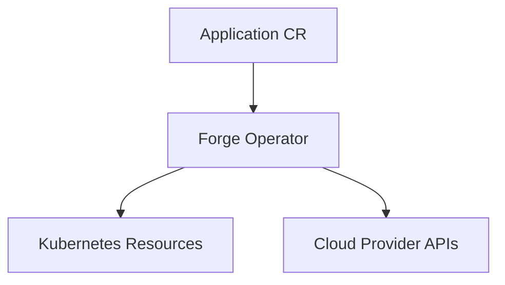
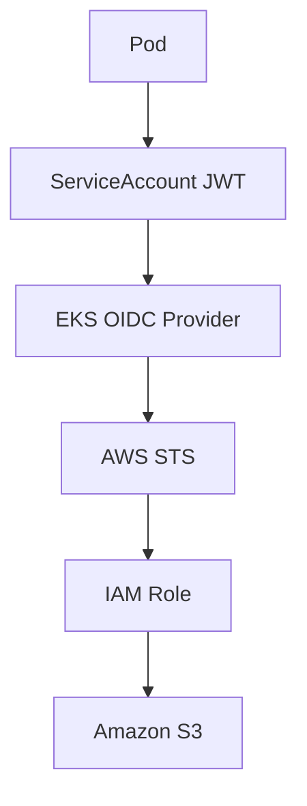
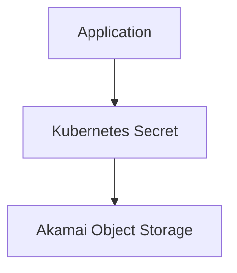
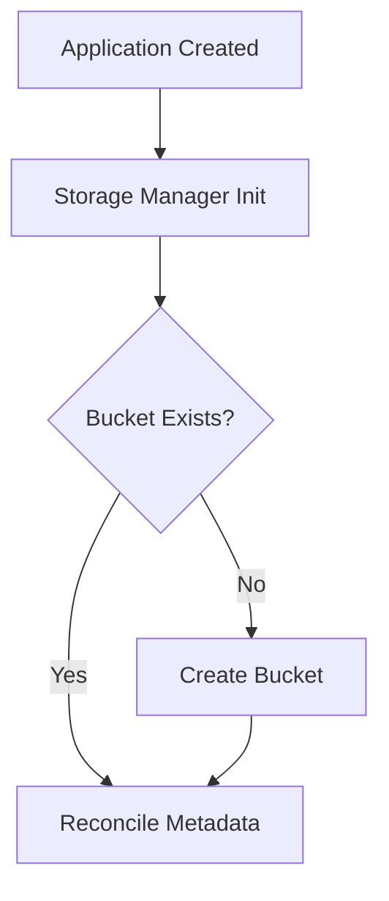

# Forge Operator

Forge Operator is a Kubernetes operator for managing application infrastructure declaratively across cloud providers.

It manages the lifecycle of application workloads, Kubernetes resources, and cloud-backed object storage through a single Application custom resource.

## Supported Providers

| Provider | Compute Target | Object Storage | Authentication Model |
| --- | --- | --- | --- |
| AWS | EKS | Amazon S3 | IAM Roles for Service Accounts (IRSA) |
| Akamai/Linode | LKE (Terraform modules) | Akamai Object Storage | S3-compatible access credentials |

## Architecture

Forge Operator follows the Kubernetes reconciliation model:



The controller reconciles:

- ServiceAccounts
- ConfigMaps
- Secrets
- Services
- Deployments
- Ingress resources
- HorizontalPodAutoscalers
- PodDisruptionBudgets
- Object storage resources and storage Secrets

Reconciliation flow is orchestrated in [internal/controller/desiredstate.go](internal/controller/desiredstate.go).

## Application API

The CRD schema is defined in [api/v1alpha1/application_types.go](api/v1alpha1/application_types.go).

Key capability areas in spec:

- application image and replica control
- container port, volume mount paths, and runtime environment
- Service and Ingress networking controls
- autoscaling and disruption budget policy
- ServiceAccount behavior
- provider-aware storage settings for AWS and Akamai

Status includes:

- condition set for readiness/progress/failure
- observed generation
- storage status payload

## Authentication Flows

### AWS IRSA Flow



No static AWS access keys are required for workloads that use IRSA.

### Akamai Object Storage Flow



Credentials are stored and managed as Kubernetes Secrets.

## Storage Lifecycle

Creation:



Deletion is finalizer-driven:

- Application deletion triggers finalizer logic
- cloud storage resources are cleaned up
- finalizer is removed and deletion completes

Finalizer logic is implemented in [internal/controller/finalizer.go](internal/controller/finalizer.go).

## Repository Structure

Primary code paths:

- [api/v1alpha1/application_types.go](api/v1alpha1/application_types.go)
- [cmd/main.go](cmd/main.go)
- [internal/controller/application_controller.go](internal/controller/application_controller.go)
- [internal/controller/finalizer.go](internal/controller/finalizer.go)
- [internal/controller/status](internal/controller/status)
- [internal/controller/s3](internal/controller/s3)
- [internal/controller/Akamai-Obj-Str](internal/controller/Akamai-Obj-Str)

Kubernetes manifests:

- [config/crd](config/crd)
- [config/rbac](config/rbac)
- [config/manager](config/manager)
- [config/samples](config/samples)

Terraform layouts:

- [Terraform/AWS](Terraform/AWS)
- [Terraform/Akamai-Linode](Terraform/Akamai-Linode)

## Terraform Infrastructure

AWS infrastructure uses [Terraform/AWS/environments/dev](Terraform/AWS/environments/dev) with modules for VPC, networking, IAM, EKS, and IRSA.

Akamai/Linode infrastructure is organized under [Terraform/Akamai-Linode/modules](Terraform/Akamai-Linode/modules) with modules for LKE, networking, and firewall, plus environment directories.

Current repository state:

- AWS dev environment is active
- Akamai/Linode dev environment exists
- prod environment directories exist and are currently incomplete

## Installation

### Prerequisites

- Kubernetes cluster
- kubectl
- Go 1.24+
- Docker
- Terraform
- Make

### Deploy Operator

Generate and install artifacts:

```sh
make manifests
make install
```

Deploy controller image:

```sh
make deploy IMG=<registry>/forge-operator:<tag>
```

Apply sample Application:

```sh
kubectl apply -k config/samples/
```

Verify:

```sh
kubectl get pods -n forge-operator-system
```

### Leader Election

Leader election is supported for high availability and can be enabled with:

- --leader-elect=true

Runtime wiring is in [cmd/main.go](cmd/main.go).

## Example Application

Sample custom resource:

- [config/samples/forge_v1alpha1_application.yaml](config/samples/forge_v1alpha1_application.yaml)

## Development

Run tests:

```sh
make test
```

Run controller locally:

```sh
make run
```

Regenerate code and manifests:

```sh
make generate
make manifests
```

Build image:

```sh
make docker-build IMG=<image>
```

## Notes

Forge Operator is under active development. Validate current build/test status and Terraform plan output in your target branch before production rollout.

## License

Copyright 2026.

Licensed under the Apache License, Version 2.0 (the "License");
you may not use this file except in compliance with the License.
You may obtain a copy of the License at

    http://www.apache.org/licenses/LICENSE-2.0

Unless required by applicable law or agreed to in writing, software
distributed under the License is distributed on an "AS IS" BASIS,
WITHOUT WARRANTIES OR CONDITIONS OF ANY KIND, either express or implied.
See the License for the specific language governing permissions and
limitations under the License.

