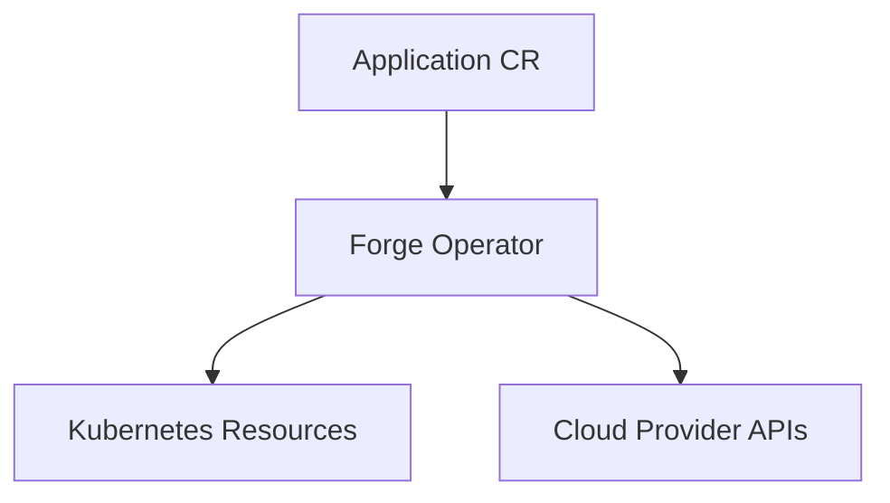

# Architecture

Forge Operator follows the Kubernetes reconciliation model:

Each reconcile pass drives these child resources toward the CR's desired state, in order:

- ServiceAccount
- ConfigMap
- Secret (application secret + storage credentials secret)
- Object storage (AWS S3 / Akamai Object Storage / no-op)
- Service
- Deployment
- Ingress
- PodDisruptionBudget
- HorizontalPodAutoscaler

Reconciliation flow is orchestrated in [internal/controller/desiredstate.go](../internal/controller/desiredstate.go). Every child resource is written with Server-Side Apply under the `forge-operator` field manager, and owned via `controllerutil.SetControllerReference` so deleting the `Application` triggers real Kubernetes garbage collection of everything it created.

The controller only reconciles on a real spec change (generation bump) or deletion — not on its own status writes — via a predicate on the primary watch. A settled, storage-backed `Application` still gets a periodic 10-minute re-check (`storageResyncInterval`) independent of that, since Kubernetes has no native way to observe drift in an external cloud resource (see [Storage ownership and drift](authentication-and-storage.md#ownership-verification) for why that matters).

## Application API

The CRD schema is defined in [api/v1alpha1/application_types.go](../api/v1alpha1/application_types.go).

Key capability areas in spec:

- application image and replica control
- container port, security context, probes, volume mount paths, and runtime environment
- Service and Ingress networking controls
- autoscaling (HPA) and disruption budget (PDB) policy
- ServiceAccount behavior (use existing or create)
- provider-aware storage settings for AWS and Akamai (optional — omit `spec.storage` entirely for no object storage)

Status includes:

- condition set (`Ready`, `Progressing`, `Degraded`) for readiness/progress/failure
- observed generation
- storage status payload (bucket, region, provider-specific outputs — **credentials are deliberately never included**, see [Security notes](development-and-operations.md#security-notes))

## Replica Count vs. Autoscaling

`spec.replicas` and `spec.autoscaling` (HPA) can both be set, and the operator resolves the conflict the way a real HPA integration should:

- No `spec.autoscaling` configured → the operator is the sole owner of replica count; it always enforces `spec.replicas` (default `1`).
- `spec.autoscaling` configured, Deployment doesn't exist yet → `spec.replicas` seeds the Deployment's *initial* replica count.
- `spec.autoscaling` configured and the Deployment already exists → the operator stops setting `replicas` on the Deployment at all (the field is omitted from its Server-Side Apply patch), so the HPA is the sole owner of scaling from then on. Changing `spec.replicas` afterward has no effect while the HPA is active.
- Removing `spec.autoscaling` hands ownership back to the operator, which resumes enforcing `spec.replicas`.

`spec.autoscaling.cpuUtilization` also requires `spec.resources.requests.cpu` to be set, enforced by a CRD-level CEL rule rejected at `kubectl apply` time — the real Kubernetes HPA controller computes CPU utilization as a percentage of the request, so without one there's nothing for it to divide by.

## ServiceAccount behavior

`spec.serviceAccount` has two fields, `name` and `create`, and the interaction between them is worth being explicit about:

| `create` | `name` | Result |
| --- | --- | --- |
| unset | unset | Operator creates and owns `<app>-sa` |
| unset | set | **Bring your own**: the pod uses the named ServiceAccount, but the operator neither creates nor owns it (no `SetControllerReference`, no Server-Side Apply against it) — safe to point at a ServiceAccount you manage yourself |
| `true` | either | Operator creates/owns it (the named one, or the generated default if `name` is unset) |
| `false` | set | Bring your own, same as the unset/set case above |
| `false` | unset | Rejected at `kubectl apply` time (CRD CEL rule) — nothing to reference and nothing to create |

The key distinction: **owning a ServiceAccount** (creating it, force-applying it, garbage-collecting it when the `Application` is deleted) and **the pod referencing one by name** are different questions. Setting `name` alone is enough to use an existing ServiceAccount without the operator ever touching it — you don't also need `create: false` for that, though setting it explicitly doesn't change anything.

Changing `spec.serviceAccount.name` (or flipping `create` from `true` to `false`/bring-your-own) on an existing `Application` doesn't orphan the old operator-owned ServiceAccount: every reconcile deletes any other ServiceAccount in the namespace that's owned by this `Application` (`metav1.IsControlledBy`) and isn't the currently-desired one.

This also applies to the AWS IRSA annotation (`eks.amazonaws.com/role-arn`): it's only ever written onto a ServiceAccount the operator owns. If you bring your own ServiceAccount for an AWS-backed `Application`, wire that annotation onto it yourself — the Role ARN is available at `status.storage.aws.roleARN` for exactly this.

## Webhooks

The `Application` CRD has an admission webhook (`internal/webhook/v1alpha1/application_webhook.go`) with both a defaulter and a validator, plus a handful of CRD-level CEL rules for checks that don't need live cluster state.

**Defaulting** is scoped to Akamai only — when `spec.storage.provider: Akamai`, resolves and writes the effective `spec.storage.secretName` and `spec.storage.akamai.accessKeySecretRef` onto the object at admission time, so `kubectl get -o yaml` always shows the real Secret names instead of requiring you to know the operator's internal fallback logic. AWS's `spec.storage.secretName` is deliberately left alone here: it's dual-purpose (see [Authentication Flows](authentication-and-storage.md#authentication-flows) below), and defaulting it the same way would silently force every pure-IRSA AWS Application onto the static-credentials path.

**Validation** covers both providers, rejecting at `kubectl apply` time rather than only surfacing later as a `Degraded` status:
- an Akamai config where `secretName` (the operator's generated output Secret) collides with `accessKeySecretRef` (your input token Secret) — the operator owns and deletes the former, so this would corrupt or destroy your token Secret;
- an Akamai config whose `accessKeySecretRef` Secret doesn't exist, or exists but is missing the `apiToken` key;
- an AWS config whose `secretName` Secret (when set — it's optional, IRSA needs none) doesn't exist, or is missing `AWS_ACCESS_KEY_ID`/`AWS_SECRET_ACCESS_KEY`;
- changing `spec.storage.provider`, `spec.storage.bucket`, or `spec.storage.region` on an existing `Application` — all three are treated as immutable once set, since each one names the identity of a real, already-provisioned cloud resource, not just descriptive state; nothing cleans up the old identity's bucket/credentials on a spec change alone, so changing any of them in place would silently orphan whatever was provisioned under the old identity while starting to treat an entirely different (and likely nonexistent) bucket as this `Application`'s storage. Delete and recreate the `Application` instead, which correctly triggers finalizer cleanup for the old identity first;
- removing `spec.config` (or `spec.secret`) while `spec.container.configMapName` (or `secretName`) still names the exact operator-managed ConfigMap/Secret that removal would delete — without this, reconcile would delete that ConfigMap/Secret out from under a Deployment whose pod template still mounts it by name, silently, until the next pod restart hits a permanent `FailedMount`. Repointing or clearing `spec.container.configMapName`/`secretName` in the same update is still allowed, as is removing `spec.config`/`spec.secret` when the container never referenced the operator's own name in the first place.

These live cluster/live-object lookups are exactly what CEL/kubebuilder validation markers structurally can't do (CEL only ever sees the object being validated). One check that *doesn't* need that, and so is a CRD-level CEL rule instead of webhook code (meaning it's still enforced even with `webhook.enabled=false`): `spec.storage.akamai`/`spec.storage.aws` must not be set when the other provider is selected.

Gated by `certManager.enabled`/`webhook.enabled` in the Helm chart (both default `true`) — see [Quickstart](../README.md#quickstart) for the cert-manager prerequisite this implies, and [Configuration](installation-and-configuration.md#configuration) for how to disable it.

## Observability

Domain-specific Prometheus metrics, optional alerts and a Grafana dashboard, and opt-in OpenTelemetry tracing — see [Observability](observability.md) for the full metric list, alert catalog, and how to wire tracing to a Jaeger/Tempo backend.

## Repository Structure

Primary code paths:

- [api/v1alpha1/application_types.go](../api/v1alpha1/application_types.go) — CRD schema
- [cmd/main.go](../cmd/main.go) — manager entrypoint
- [internal/controller/application_controller.go](../internal/controller/application_controller.go) — reconcile loop
- [internal/controller/finalizer.go](../internal/controller/finalizer.go) — deletion/cleanup
- [internal/controller/status](../internal/controller/status) — condition management
- [internal/controller/s3](../internal/controller/s3) — AWS S3 + IRSA
- [internal/controller/Akamai-Obj-Str](../internal/controller/Akamai-Obj-Str) — Akamai/Linode Object Storage

Kubernetes manifests:

- [config/crd](../config/crd) — generated CRD (source of truth; `charts/chart/templates/crd` and `dist/install.yaml` are regenerated from this)
- [config/rbac](../config/rbac)
- [config/manager](../config/manager)
- [config/samples](../config/samples)
- [charts/chart](../charts/chart) — Helm chart (published to GHCR on release)

Terraform layouts:

- [Terraform/AWS](../Terraform/AWS)
- [Terraform/Akamai-Linode](../Terraform/Akamai-Linode)
