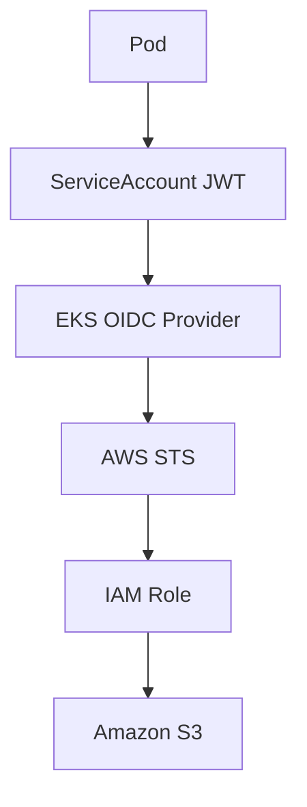
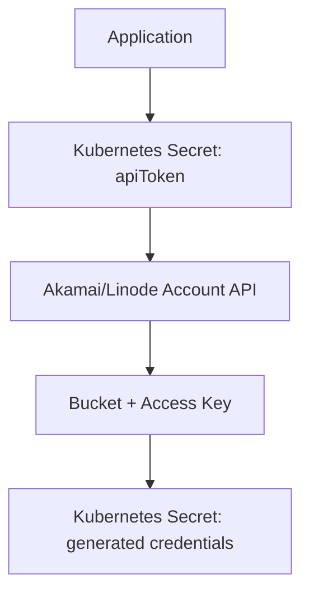
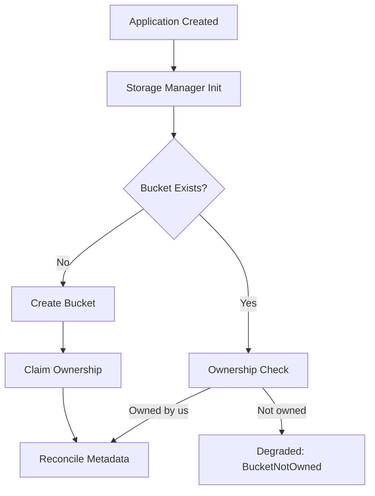

# Authentication Flows

## AWS IRSA Flow



No static AWS access keys are required for workloads that use IRSA. The controller needs `OIDC_PROVIDER_ARN` and `OIDC_PROVIDER_URL` set in its environment (see [Configuration](installation-and-configuration.md#configuration)) to construct the IRSA trust policy.

### Wiring the controller's own IRSA role after `terraform apply`

The steps above are about the trust policy the *controller* writes for each `Application`'s own role — but the controller's own pod also needs credentials to call AWS in the first place, via its own separate IRSA role (`module.irsa` in the Terraform tree, see [Terraform Infrastructure](installation-and-configuration.md#terraform-infrastructure)). That role's ARN is a `terraform apply` output, so it can't be baked into the chart — it has to be passed explicitly on install/upgrade:

```sh
terraform -chdir=Terraform/AWS/environments/dev output -raw irsa_role_arn
```

```sh
helm upgrade --install forge-operator oci://ghcr.io/ningendo7/forge-operator/charts/forge-operator \
  --version <released-version> \
  --namespace forge-operator-system \
  --create-namespace \
  --set serviceAccount.annotations."eks\.amazonaws\.com/role-arn"=<the-output-above>
```

Two things worth knowing:

- **`helm upgrade` does not carry forward previous `--set` values** unless you also pass `--reuse-values` — repeat every flag you set previously (including this one), or they silently reset to chart defaults.
- The annotation only takes effect on **newly scheduled pods** — the EKS Pod Identity Webhook injects the `AWS_ROLE_ARN`/`AWS_WEB_IDENTITY_TOKEN_FILE` env vars and the projected token volume at pod admission time, not by watching the ServiceAccount live. After setting or changing this annotation, restart the deployment:
  ```sh
  kubectl rollout restart deployment/forge-operator-controller-manager -n forge-operator-system
  ```

## Akamai Object Storage Flow



Two distinct Secrets are involved, and they must **not** share a name:

- **Input** — a Secret you create yourself, named `<application-name>-akamai-token` by default (override via `spec.storage.akamai.accessKeySecretRef`), holding your Akamai/Linode API token under the `apiToken` key.
- **Output** — the Secret the operator generates and owns, named `<application-name>-storage` by default (override via `spec.storage.secretName`), holding the bucket's generated access/secret key. This Secret is deleted along with the `Application` (it's controller-owned), so it must never be the same Secret as the input token above.

Akamai has no IRSA-equivalent (no OIDC/workload-identity federation for short-lived credentials), so a long-lived personal access token stored in a Secret is the only mechanism the platform supports — this isn't a stand-in for something more sophisticated. To bootstrap the input token:

1. In [Cloud Manager](https://cloud.linode.com/profile/tokens), go to **My Profile → API Tokens → Create a Personal Access Token**.
2. Set an expiry (rotate it before then), and scope it to **Object Storage: Read/Write** only — leave every other product/service at **No Access**. Akamai's token scoping is per-product, not fully granular IAM roles, but this still keeps the token from being able to touch Linodes, LKE, DNS, etc. if it ever leaks.
3. Create the Secret with that token:
   ```sh
   kubectl create secret generic <application-name>-akamai-token \
     --namespace <application-namespace> \
     --from-literal=apiToken=<the-token-you-just-created>
   ```

One region gotcha specific to Akamai: `spec.storage.region` must be a modern Linode region slug (e.g. `us-iad`, matching what LKE itself uses), **not** the older `-1`-suffixed cluster form (e.g. `us-iad-1`) — that form is deprecated on Linode's side. Check which regions actually offer Object Storage for your account in Cloud Manager before setting this.

### Giving the workload itself access to its bucket

Everything above is about the *operator's* access to Akamai's account API to manage the bucket/key — it doesn't by itself give the `Application`'s own pod anything to read or write with. AWS gets that transparently via IRSA (the pod assumes the per-app IAM role directly, no static credentials involved). Akamai has no IRSA equivalent, so this is opt-in instead: set `spec.storage.akamai.injectCredentials: true` and the operator injects `AWS_ACCESS_KEY_ID`, `AWS_SECRET_ACCESS_KEY`, `AWS_ENDPOINT_URL`, `AWS_REGION`, and `FORGE_STORAGE_BUCKET` as env vars on every container, each sourced individually via `valueFrom.secretKeyRef` against the operator's own generated output Secret (not a blanket `envFrom`, so the container's env stays legible in `kubectl describe pod`). `AWS_ENDPOINT_URL` is deliberately the non-bucket-prefixed hostname (stripped of the `<bucket>.` prefix the operator's own internal client uses) so that any standard path-style S3 client — the AWS SDK, `aws-cli`, `mc`, etc. — works against it without double-prefixing the bucket name. Defaults to `false`. If `spec.env` also sets any of these same names, yours wins — injected defaults are prepended, `spec.env` is appended after.

Whichever client picks these up only sees the new values after the pod is recreated — like any Secret consumed via `secretKeyRef`, a running pod does not live-update if the operator rewrites the Secret later (e.g. after a key rotation); a rollout restart is required.

# Storage Lifecycle

Creation:



## Ownership verification

Before an `Application` reconciles against an existing bucket — whether it's finding one that already exists, or one it just created a moment ago — the operator verifies it's actually the owner, rather than silently adopting (and potentially later deleting) a bucket someone else created with the same name:

- **AWS**: the bucket is tagged with the `Application`'s Kubernetes UID (`forge-operator.ningendo7.github.io/owner-uid`) on creation.
- **Akamai**: Linode's Object Storage bucket API has no tagging support at all, so a small marker object (`.forge-operator-owner`) is written inside the bucket instead, via the S3-compatible protocol using the generated access key.

On every reconcile, the rule is the same for both providers: **no tag/marker at all → claim it, but only if this operator durably recorded (in `Application.status`) having created this exact bucket itself within the last hour, or the adopt-bucket annotation (below) is set; present and naming a different Application → reject (`Degraded`, reason `BucketNotOwned`), unless adopt-bucket is set; present and matching → proceed.**

That "claim on missing tag/marker, if we made it" rule is deliberate, not an oversight: an earlier design only claimed a bucket if it was created *in that exact reconcile call*, which had a self-lockout bug — if the tag/marker write failed transiently right after a real, successful bucket creation, every later reconcile would find the bucket already existing with no marker on it, and permanently treat it as foreign with no way to recover. Recording creation in `Application.status` and trusting that record for a bounded window (`bucketCreationClaimWindow`, currently **1 hour**) lets a retry within that window recover automatically, without going as far as treating *any* untagged bucket as automatically ours forever — a bucket name is released back to the provider's global namespace on deletion, so an unconditional rule would let this operator silently reclaim a completely unrelated bucket that happens to reuse a name we once had. If the tag/marker write keeps failing for longer than that hour (e.g. the operator was down, or crash-looping), the bucket falls back to being treated as foreign, and recovering it requires the same manual adopt-bucket annotation used for a `deletionPolicy: Retain` bucket, below — there's no unbounded automatic retry.

If you ever delete and recreate an `Application` that's meant to reuse a bucket it previously owned, note that Kubernetes assigns a new UID on recreation — the bucket will read as not-owned even though it's logically "the same" Application from your perspective. This is the safe default (never silently reclaim). To deliberately take over a bucket owned by a different Application's UID — the common case being a bucket left behind by [`deletionPolicy: Retain`](#deletion-policy) — set this annotation on the new `Application`:

```yaml
metadata:
  annotations:
    forge-operator.ningendo7.github.io/adopt-bucket: "true"
```

With that set, a mismatched tag/marker is overwritten with the current Application's own UID instead of being rejected — but only if the `Application` that currently owns the bucket (per the UID in that tag/marker) can no longer be found in the cluster. This is a live check against the Kubernetes API at reconcile time, not just a permission gate: adopt-bucket is meant to reclaim a bucket left behind by an `Application` that's genuinely gone, not to let a second `Application` take a bucket away from one that's still alive and using it. If the previous owner still exists, adoption is refused the same as if adopt-bucket weren't set at all (`Degraded`, reason `BucketNotOwned`). It's still a deliberate, explicit, human-in-the-loop opt-in otherwise — there's no automatic reclaiming.

This check needs a cluster-wide list of `Application`s, since the tag/marker only ever stores a bare UID with no namespace to scope the lookup to. That's already covered by this chart's default RBAC mode (a ClusterRole). If you instead install with `rbac.namespaced: true` (a `Role`, scoped to one namespace), this check can only ever see `Application`s in the operator's own namespace — any error or an incomplete view is treated as "cannot confirm the previous owner is gone," so adoption fails closed (refused) rather than risking a live takeover, but this does mean adopt-bucket may never succeed at all under `rbac.namespaced: true` for a previous owner in a different namespace.

## AWS bucket versioning and lifecycle policy

Both are configurable under `spec.storage.aws`:

```yaml
spec:
  storage:
    provider: AWS
    bucket: my-bucket
    aws:
      versioningEnabled: false   # defaults to true when unset
      lifecycleRules:
        - id: expire-old-objects
          prefix: logs/
          expirationDays: 90
        - id: archive-after-30-days
          transitions:
            - days: 30
              storageClass: STANDARD_IA
```

`versioningEnabled` defaults to `true` when unset (the operator's original hardcoded behavior). Explicitly setting it `false` suspends versioning — S3 has no way to fully un-version a bucket once versioning has ever been enabled, only enable/suspend.

`lifecycleRules` has three states, and the distinction matters:
- **Left out entirely** → a single default rule applies (abort incomplete multipart uploads after 7 days, expire noncurrent versions after 30 days, transition to `STANDARD_IA` after 30 days) — the same behavior as before this field existed, so upgrading doesn't change anything for existing Applications.
- **Set to an explicit empty list** (`lifecycleRules: []`) → removes lifecycle policy from the bucket entirely.
- **Set to one or more rules** → fully replaces the default with exactly what you specified.

Each rule supports `id`, `enabled` (default `true`), `prefix`, `expirationDays`, `noncurrentVersionExpirationDays`, `abortIncompleteMultipartUploadDays`, and `transitions` (each with `days` and `storageClass`, one of `STANDARD_IA`, `ONEZONE_IA`, `INTELLIGENT_TIERING`, `GLACIER`, `DEEP_ARCHIVE`, `GLACIER_IR`).

## Drift detection

Kubernetes has no native way to observe a cloud resource changing outside its control — if a bucket is deleted directly in the AWS/Linode console, nothing tells the operator. A settled, `Ready`, storage-backed `Application` is re-reconciled every 10 minutes (`storageResyncInterval`) specifically to catch this: the same idempotent bucket-creation logic that runs on first reconcile runs again, so a deleted bucket gets recreated (and re-claimed) automatically within that window. There's no faster built-in signal than that — if you need to force an immediate recheck, any spec change (or a manual `kubectl annotate`/`kubectl patch` touching spec) triggers a reconcile immediately rather than waiting out the interval.

## Deletion policy

`spec.storage.deletionPolicy` controls what happens to the bucket when the `Application` is deleted — `Delete` (default) or `Retain`, mirroring the same concept as a Kubernetes PersistentVolume's `reclaimPolicy`:

```yaml
spec:
  storage:
    deletionPolicy: Retain
```

`Retain` skips cloud deletion entirely: the bucket and its ownership tag/marker are left exactly as-is. The Kubernetes `Application` object and its finalizer are still removed normally — only the cloud resource is kept. This is surfaced as a `Normal` `StorageRetained` Event (`kubectl get events`) and a `StorageReady` condition with reason `BucketRetained`, so it's visible and auditable rather than silent. See [Ownership verification](#ownership-verification) above for how to later reclaim a retained bucket with a new `Application`.

## Deletion

Deletion is finalizer-driven:

- Application deletion triggers finalizer logic ([internal/controller/finalizer.go](../internal/controller/finalizer.go)), unless `deletionPolicy: Retain` short-circuits it (see above)
- cloud storage resources are cleaned up (bucket deletion for AWS/Akamai)
- finalizer is removed and deletion completes

**This only runs if the operator is actually alive to see the deletion event.** If you tear down the underlying Kubernetes cluster itself (e.g. `terraform destroy` on the EKS/LKE cluster) while an `Application` with storage still exists, the finalizer never gets a chance to run — the whole control plane disappears at once, taking the pending deletion with it, and any cloud storage bucket is left orphaned (still billed, on providers that charge for it) with nothing left to track it. **Always delete `Application` resources — and confirm their storage finalizer has actually completed (`kubectl get application <name> -o jsonpath='{.metadata.finalizers}'` returns empty) — before tearing down the cluster underneath them.**

Cleanup ordering is credential-first on both providers (IAM role / access key torn down before the bucket itself), and both providers now behave the same way if that credential cleanup fails: it does **not** block bucket deletion or the finalizer. The bucket is the billed resource, so guaranteeing its deletion takes priority over a transient failure cleaning up the (free-to-hold) IAM role or access key. That failure isn't silent, though — it's surfaced as a `Warning` Event (`IRSACleanupFailed` on AWS, `AccessKeyCleanupFailed` on Akamai, visible via `kubectl describe application <name>` or `kubectl get events`) rather than only appearing in operator logs, so a stray IAM role or access key left behind by a failed cleanup is still discoverable.

Earlier behavior on AWS actually blocked the whole finalizer on a failed IAM role cleanup (so it never diverged from bucket deletion, but a permissions issue on the role alone could leave a bucket's deletion — and thus the `Application` itself — stuck indefinitely). That was changed to match Akamai's always-non-blocking pattern after a live test surfaced exactly this: an IAM cleanup failure with no unrelated bucket-deletion problem still left the finalizer stuck.

## Removing `spec.storage` from an existing Application

Editing an `Application` to drop `spec.storage` entirely (rather than deleting the `Application` itself) triggers the same cleanup described above — same `deletionPolicy` respected, same credential-first ordering, same non-blocking `Warning` Event on a credential-cleanup failure — sourced from `Status.Storage` rather than `Spec.Storage`, since the latter is already gone by the time this runs. `Status.Storage` and the `StorageReady` condition are both cleared once cleanup completes, so the `Application` ends up looking exactly like one that never had storage configured at all — not stuck showing a stale `Ready`/`Degraded` storage condition for a bucket that no longer has a `spec.storage` block behind it.
