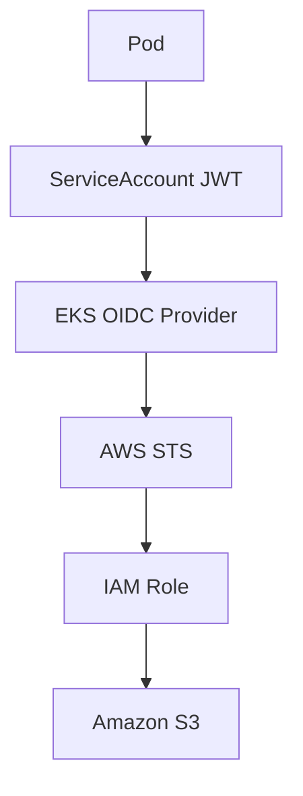
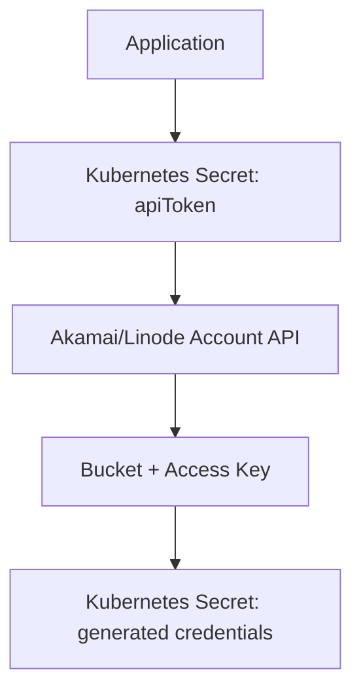
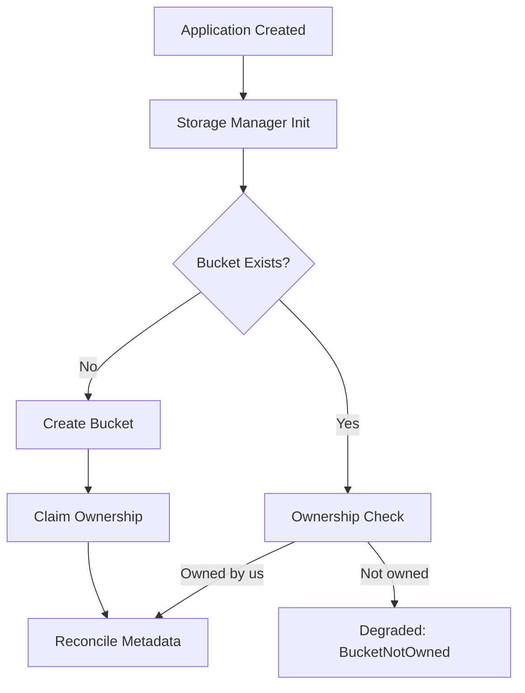

# Authentication Flows

## AWS IRSA Flow



No static AWS access keys are required for workloads that use IRSA. The controller needs `OIDC_PROVIDER_ARN` and `OIDC_PROVIDER_URL` set in its environment (see [Configuration](installation-and-configuration.md#configuration)) to construct the IRSA trust policy.

### Wiring the controller's own IRSA role after `terraform apply`

The steps above are about the trust policy the *controller* writes for each `Application`'s own role — but the controller's own pod also needs credentials to call AWS in the first place, via its own separate IRSA role (`module.irsa` in the Terraform tree, see [Terraform Infrastructure](installation-and-configuration.md#terraform-infrastructure)). That role's ARN is a `terraform apply` output, so it can't be baked into the chart — it has to be passed explicitly on install/upgrade:

```sh
terraform -chdir=Terraform/AWS/environments/dev output -raw irsa_role_arn
```

```sh
helm upgrade --install forge-operator oci://ghcr.io/ningendo7/forge-operator/charts/forge-operator \
  --version <released-version> \
  --namespace forge-operator-system \
  --create-namespace \
  --set serviceAccount.annotations."eks\.amazonaws\.com/role-arn"=<the-output-above>
```

Two things worth knowing:

- **`helm upgrade` does not carry forward previous `--set` values** unless you also pass `--reuse-values` — repeat every flag you set previously (including this one), or they silently reset to chart defaults.
- The annotation only takes effect on **newly scheduled pods** — the EKS Pod Identity Webhook injects the `AWS_ROLE_ARN`/`AWS_WEB_IDENTITY_TOKEN_FILE` env vars and the projected token volume at pod admission time, not by watching the ServiceAccount live. After setting or changing this annotation, restart the deployment:
  ```sh
  kubectl rollout restart deployment/forge-operator-controller-manager -n forge-operator-system
  ```

## Akamai Object Storage Flow



Two distinct Secrets are involved, and they must **not** share a name:

- **Input** — a Secret you create yourself, named `<application-name>-akamai-token` by default (override via `spec.storage.akamai.accessKeySecretRef`), holding your Akamai/Linode API token under the `apiToken` key.
- **Output** — the Secret the operator generates and owns, named `<application-name>-storage` by default (override via `spec.storage.secretName`), holding the bucket's generated access/secret key. This Secret is deleted along with the `Application` (it's controller-owned), so it must never be the same Secret as the input token above.

Akamai has no IRSA-equivalent (no OIDC/workload-identity federation for short-lived credentials), so a long-lived personal access token stored in a Secret is the only mechanism the platform supports — this isn't a stand-in for something more sophisticated. To bootstrap the input token:

1. In [Cloud Manager](https://cloud.linode.com/profile/tokens), go to **My Profile → API Tokens → Create a Personal Access Token**.
2. Set an expiry (rotate it before then), and scope it to **Object Storage: Read/Write** only — leave every other product/service at **No Access**. Akamai's token scoping is per-product, not fully granular IAM roles, but this still keeps the token from being able to touch Linodes, LKE, DNS, etc. if it ever leaks.
3. Create the Secret with that token:
   ```sh
   kubectl create secret generic <application-name>-akamai-token \
     --namespace <application-namespace> \
     --from-literal=apiToken=<the-token-you-just-created>
   ```

One region gotcha specific to Akamai: `spec.storage.region` must be a modern Linode region slug (e.g. `us-iad`, matching what LKE itself uses), **not** the older `-1`-suffixed cluster form (e.g. `us-iad-1`) — that form is deprecated on Linode's side. Check which regions actually offer Object Storage for your account in Cloud Manager before setting this.

# Storage Lifecycle

Creation:



## Ownership verification

Before an `Application` reconciles against an existing bucket — whether it's finding one that already exists, or one it just created a moment ago — the operator verifies it's actually the owner, rather than silently adopting (and potentially later deleting) a bucket someone else created with the same name:

- **AWS**: the bucket is tagged with the `Application`'s Kubernetes UID (`forge-operator.ningendo7.github.io/owner-uid`) on creation.
- **Akamai**: Linode's Object Storage bucket API has no tagging support at all, so a small marker object (`.forge-operator-owner`) is written inside the bucket instead, via the S3-compatible protocol using the generated access key.

On every reconcile, the rule is the same for both providers: **no tag/marker at all → claim it; present and naming a different Application → reject (`Degraded`, reason `BucketNotOwned`); present and matching → proceed.** That "claim on missing marker" rule is deliberate, not an oversight: an earlier design only claimed a bucket if it was created *in that exact reconcile call*, which had a self-lockout bug — if the tag/marker write failed transiently right after a real, successful bucket creation, every later reconcile would find the bucket already existing with no marker on it, and permanently treat it as foreign with no way to recover. The unified rule accepts a much rarer, lower-consequence risk instead (something else claiming the exact same operator-scoped bucket name in the narrow window before the tag/marker write lands).

If you ever delete and recreate an `Application` that's meant to reuse a bucket it previously owned, note that Kubernetes assigns a new UID on recreation — the bucket will read as not-owned even though it's logically "the same" Application from your perspective. This is the safe default (never silently reclaim); there's currently no override for the legitimate recovery case, so you'd need to intervene manually (e.g. re-tag the bucket, or point the new `Application` at a fresh bucket name).

## Drift detection

Kubernetes has no native way to observe a cloud resource changing outside its control — if a bucket is deleted directly in the AWS/Linode console, nothing tells the operator. A settled, `Ready`, storage-backed `Application` is re-reconciled every 10 minutes (`storageResyncInterval`) specifically to catch this: the same idempotent bucket-creation logic that runs on first reconcile runs again, so a deleted bucket gets recreated (and re-claimed) automatically within that window. There's no faster built-in signal than that — if you need to force an immediate recheck, any spec change (or a manual `kubectl annotate`/`kubectl patch` touching spec) triggers a reconcile immediately rather than waiting out the interval.

## Deletion

Deletion is finalizer-driven:

- Application deletion triggers finalizer logic ([internal/controller/finalizer.go](../internal/controller/finalizer.go))
- cloud storage resources are cleaned up (bucket deletion for AWS/Akamai; no-op for `Static`/`MinIO`)
- finalizer is removed and deletion completes

**This only runs if the operator is actually alive to see the deletion event.** If you tear down the underlying Kubernetes cluster itself (e.g. `terraform destroy` on the EKS/LKE cluster) while an `Application` with storage still exists, the finalizer never gets a chance to run — the whole control plane disappears at once, taking the pending deletion with it, and any cloud storage bucket is left orphaned (still billed, on providers that charge for it) with nothing left to track it. **Always delete `Application` resources — and confirm their storage finalizer has actually completed (`kubectl get application <name> -o jsonpath='{.metadata.finalizers}'` returns empty) — before tearing down the cluster underneath them.**

Cleanup ordering is credential-first on both providers (IAM role / access key deleted before the bucket itself), but the two providers differ in one respect worth knowing: on AWS, a failed IAM role cleanup blocks the whole finalizer (it'll retry on the next reconcile). On Akamai, a failed access-key cleanup does **not** block bucket deletion — the bucket is the billed resource, so guaranteeing its deletion takes priority over a transient failure cleaning up the (free) access key. That failure isn't silent, though: it's surfaced as a `Warning` Event (`AccessKeyCleanupFailed`, reason visible via `kubectl describe application <name>` or `kubectl get events`) rather than only appearing in operator logs.
